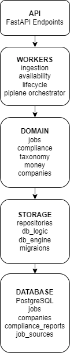

# System Architecture – OpenJobsEU

## Overview

OpenJobsEU is an open-source, compliance-first platform for aggregating legally accessible remote job offers within the European Union.

The system is designed as a backend-oriented platform with a strong emphasis on:
- clear separation of concerns
- data freshness and lifecycle management
- infrastructure automation
- operational transparency

User-facing features are intentionally minimal at this stage.

---

## High-Level Architecture



The system operates as a periodic worker pipeline:

ingestion → persistence → availability → lifecycle → read API

Availability checks and lifecycle transitions run asynchronously and do not block ingestion or API requests.

---

## Core Components

### Ingestion Adapters

Each external job source is integrated through a dedicated ingestion adapter responsible for:
- fetching job data
- handling source-specific formats
- transforming raw data into the canonical job model

Adapters are isolated to ensure that failures in one source do not affect the rest of the system.

---

### Ingestion Mode

OpenJobsEU supports multiple ingestion modes:

- `rss` (default) – real job ingestion via RSS feeds
- `local` – development-only ingestion from a local JSON file

The mode is controlled via the `INGESTION_MODE` environment variable.

Example (development fallback):

```bash
INGESTION_MODE=local
```

Local ingestion is intended strictly for testing and debugging and is not used in production.

---

## Normalization Layer

All incoming job data is normalized into a single canonical model to ensure:

- consistent querying
- predictable filtering
- source-agnostic processing

The normalization layer enforces required fields and produces a uniform representation regardless of source.

---

## Job Store

The job store acts as the system’s single source of truth and is responsible for:

- persisting normalized job data
- tracking job lifecycle state
- storing timestamps related to ingestion and verification

The current implementation uses SQLite and is designed to be replaceable with a relational database in later stages.

---

## Availability Checker

Job availability is verified asynchronously by a background worker that:

- periodically checks original job URLs
- interprets HTTP response codes
- updates job status accordingly

This mechanism prioritizes data freshness over raw job volume.

---

## Job Lifecycle

Jobs move through a defined lifecycle:

- NEW – recently discovered jobs (first 24h)
- ACTIVE – verified and visible jobs
- STALE – jobs not verified within a defined time window
- EXPIRED – jobs confirmed unavailable or outdated

From an API consumer perspective, NEW and ACTIVE jobs are treated as visible.

---

## Read API

The Read API exposes job data in a read-only manner.

Currently supported endpoints:

### List jobs
``` GET /jobs```


Query parameters:

- ```status```: visible | new | active | stale | expired
- ```limit```: default 20
- ```offset```: default 0

Example:

```GET /jobs?status=visible```

The API is stateless and designed to scale horizontally.

---

## Infrastructure

OpenJobsEU infrastructure follows cloud-native practices:
- containerized services
- Infrastructure as Code (Terraform)
- automated CI/CD pipelines
- environment-based configuration

The system is currently deployed on Google Cloud Run, with provider portability in mind.

---

## Observability

Basic observability is provided via:
- structured application logs
- health check endpoints
- Cloud Run and Cloud Scheduler execution logs

More advanced metrics and alerting are planned for later stages.

---

## Compliance and Legal Boundaries

OpenJobsEU explicitly avoids:
- scraping closed or protected job platforms
- automating interactions with third-party systems
- storing or redistributing proprietary content

All data processing is limited to legally accessible sources or explicit submissions.

---

