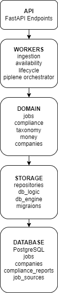

# System Architecture – OpenJobsEU

## Overview

OpenJobsEU is designed as a **Modular Monolith** deployed in a **Serverless** environment (GCP Cloud Run). It is a backend-first, compliance-focused pipeline for aggregating legally accessible remote job offers with EU relevance signals.

The platform is optimized for zero-maintenance operation, high scalability during ingestion bursts, and minimal cloud infrastructure costs (zero-compute public architecture).

---

## High-Level Flow

Pipeline mode flow:

`Cloud Scheduler` -> `Cloud Tasks` -> `Ingestion Worker` -> `DB Upsert` -> `Lifecycle/Availability/Market/Maintenance` -> `Feed Exporter (GCS)` -> `Public (CDN)`

---

## Runtime Orchestration

- Trigger endpoints live in `app/api/system.py` and route through `app/api/router.py` under `/internal`.
- Runtime execution entrypoint: `POST /internal/tick/execute` (via Cloud Tasks) -> `app.workers.pipeline.run_pipeline`
- Hybrid/manual trigger: `POST /internal/tick` decides between direct execution and Cloud Tasks enqueue depending on queue configuration.
- Tick pipeline orchestration:
  - runs `run_employer_ingestion()`
  - runs `run_lifecycle_pipeline()`
  - runs `run_availability_pipeline()`
  - runs `run_market_metrics_worker()`
  - runs `run_maintenance_pipeline()`
  - runs `run_frontend_export()`
- Ingestion worker is single-source and ATS-backed (`employer_ing`)

---

## Ingestion Layer

### `employer_ing`

Runtime path:
- loads active ATS companies from `companies` table (`is_active=true`, `ats_provider`, `ats_slug`)
  - batched to 100 companies per tick, ordered by `company_ats.updated_at ASC`
- adapters resolved via `app/adapters/ats/registry.py`
- current adapter implementations:
  - `app/adapters/ats/greenhouse.py`
  - `app/adapters/ats/lever.py`
  - `app/adapters/ats/workable.py`
  - `app/adapters/ats/ashby.py`
  - `app/adapters/ats/personio.py`
  - `app/adapters/ats/recruitee.py`
  - `app/adapters/ats/smartrecruiters.py`
  - `app/adapters/ats/jobadder.py`
  - `app/adapters/ats/teamtailor.py` *(token-based: `ats_slug` stores the API token, not a public board identifier)*
  - `app/adapters/ats/traffit.py`
  - `app/adapters/ats/breezy.py`
- normalization happens inside adapters (`normalize()`)
- policy tagging uses `app/domain/compliance/engine.py` (`apply_policy`)

`employer_ing` can hard-skip records with `geo_restriction_hard` signals before DB upsert.

---

## Storage Layer

The storage backend uses SQLAlchemy Core and PostgreSQL.

Current deployed database mode:
- `DB_MODE=standard` + `DATABASE_URL=postgresql+psycopg://...`
- active `dev` and `prod` deployments use Aiven PostgreSQL

Legacy/optional code path still present in the runtime:
- `DB_MODE=cloudsql` + Cloud SQL connector settings (`INSTANCE_CONNECTION_NAME`, `DB_NAME`, `DB_USER`)

Schema initialization is Alembic-based (`storage/alembic/`, `alembic.ini`) and applied at startup via `alembic upgrade head`.

Core tables:
- `jobs`
- `companies`

`jobs.company_id` references `companies.company_id` (nullable FK).

---

## Classification and Compliance

At write-time, job rows are normalized to canonical classes (`remote_class`, `geo_class`) during upsert.

Compliance policy is applied during ingestion before persistence.

---

## Post-Ingestion Workers

Maintenance/runtime steps executed after ingestion:
- lifecycle transitions (`app/workers/lifecycle.py`)
- availability checks (`app/workers/availability.py` - uses adaptive time-budgeting to maximize throughput)
- daily market metrics (`app/workers/market_metrics.py`)
- company maintenance/stat refresh (`app/workers/maintenance.py`)
- static frontend feed generation to Cloud Storage (`app/workers/frontend_exporter.py`)

Lifecycle states in runtime:
- `new`, `active`, `stale`, `expired`, `unreachable`

---

## API Layer & Zero-Compute Public Strategy

OpenJobsEU has one active access model in `dev` and `prod`: the Cloud Run runtime is private, while public read access is served only from static assets in Cloud Storage/CDN. This means `GET /jobs`, `GET /companies`, and `GET /jobs/stats/compliance-7d` remain available in application code but are treated as internal/admin-only runtime interfaces, not public internet APIs.

### Access surface

| Interface | Backing layer | Audience | Notes |
|---|---|---|---|
| `GET /feed.json` | GCS + CDN | Public | Zero-compute data feed exported by `run_frontend_export(export_feed=True)` during runtime maintenance. |
| Static frontend (`/`, `index.html`, JS/CSS assets) | GCS + CDN | Public | Read-only website consuming `feed.json`, published separately by CI/CD after a successful production deploy. |
| Looker Studio audit report | Aiven PostgreSQL reporting views | Selected Google accounts | Private read-only audit reporting backed by `vw_looker_audit_*` views. |
| `GET /health`, `GET /ready` | Private Cloud Run | Internal/admin | Operational endpoints on the private runtime. |
| `GET /jobs`, `GET /companies`, `GET /jobs/stats/compliance-7d` | Private Cloud Run | Internal/admin | Read/query endpoints reachable only by callers with Cloud Run IAM access. |
| `/internal/*` | Private Cloud Run | Internal/admin | Scheduler, Cloud Tasks, and audit/ops tooling. |

Feed behavior (`feed.json` contract):
- visible jobs only (`new`, `active`)
- minimum compliance score: `80`
- cache header: `Cache-Control: public, max-age=300`

### Ownership Model (Least Privilege)

- **Frontend Assets (HTML/CSS/JS)**: Owned by the CI/CD pipeline or deploy scripts. Published only after a successful production deploy, via `scripts/publish_frontend_assets.py`.
- **Data Feed (`feed.json`)**: Owned by the Runtime pipeline (Frontend Exporter). Updated frequently during maintenance ticks via `run_frontend_export(export_feed=True)`.
To enforce security boundaries, the Cloud Run service account can stay restricted to editing only `feed.json`, while the deploy credential used by CI publishes `frontend/index.html`, `frontend/style.css`, and `frontend/feed.js`.

### Publication split: runtime data vs deploy-time assets

**Runtime refresh (`feed.json`)**
- Trigger: maintenance ticks / backend pipeline execution.
- Publisher: private runtime worker `app/workers/frontend_exporter.py`.
- Scope: only `feed.json`.
- Goal: update visible jobs frequently without redeploying frontend files.

**Deploy/sync static assets**
- Trigger: `prod_flow` CI, after `build-deploy-prod` finishes successfully.
- Publisher: `scripts/publish_frontend_assets.py`, reusing `run_frontend_export(sync_assets=True, export_feed=False)`.
- Scope: `frontend/index.html`, `frontend/style.css`, `frontend/feed.js`.
- Goal: release-controlled publication of website shell and JS/CSS changes.

**Cache busting**
- `frontend/index.html` is published as the mutable entrypoint with short cache lifetime.
- `frontend/style.css` and `frontend/feed.js` receive release-based cache busting through `?v=<release tag or commit SHA>` injected during CI publication.
- This keeps frontend changes visible immediately after deploy without handing asset overwrite privileges to the runtime service account.

Internal endpoints:
- `POST /internal/tick` (`format=auto|text|json`, `incremental=true|false`, `limit=100`)
- `GET /internal/audit`
- `GET /internal/audit/jobs`
- `GET /internal/audit/filters`
- `GET /internal/audit/stats/company`
- `GET /internal/audit/stats/source-7d`
- `POST /internal/audit/tick-dev`
- `POST /internal/backfill-compliance`
- `POST /internal/tasks/{task_name}` (Delegates async processes to Cloud Tasks via Hybrid Router)
- `POST /internal/tasks/{task_name}/execute` (Strictly Machine-to-Machine Cloud Tasks handler with OIDC `audience` validation; legacy `X-Internal-Secret` fallback strictly disabled outside `APP_RUNTIME=local`)
- `POST /internal/discovery/company-sources`
- `POST /internal/discovery/careers`
- `POST /internal/discovery/ats-reverse`
- `POST /internal/discovery/guess`
- `POST /internal/discovery/dorking`
- `POST /internal/discovery/run`
- `POST /internal/discovery/slug-harvest` *(triggers slug harvest discovery phase)*
- `POST /internal/discovery/promote-discovered` *(promotes validated discovered slugs to `company_ats`)*
- `GET /internal/discovery/slug-candidates` *(UI/API view for discovered slug candidates; defaults to `status=needs_token`)*

Audit panel data shape:
- `/internal/audit/filters` returns canonical filter lists and dynamic `source` values from DB
- `/internal/audit/jobs` uses high-performance `GROUPING SETS` for instant metadata aggregations
- `/internal/audit/stats/company` provides aggregated compliance ratio by `companies.legal_name` (`HAVING COUNT(*) > 10` by default)
- `/internal/audit/stats/source-7d` provides aggregated compliance ratio by source for rows with `first_seen_at` in last 7 days

### Security & Environment Matrix

OpenJobsEU enforces strict configuration rules depending on the runtime environment to ensure security while preserving the developer experience locally.

| Environment | `APP_RUNTIME` | OIDC for M2M | Session/OAuth (Admin UI) | Required Secrets |
|---|---|---|---|---|
| **Local** | `local` | Disabled (Shared Secret fallback) | Dummy allowed (throws HTTP 500 on login) | None (`dummy-*` fallbacks used safely) |
| **Dev** | `cloud` (default) | Enforced (Internal-Only) | Strict (Fail-fast on startup) | `GOOGLE_CLIENT_ID`, `GOOGLE_CLIENT_SECRET`, `SESSION_SECRET_KEY`, `ALLOWED_AUTH_EMAIL` |
| **Prod** | `cloud` (default) | Enforced (Internal-Only) | Strict (Fail-fast on startup) | `GOOGLE_CLIENT_ID`, `GOOGLE_CLIENT_SECRET`, `SESSION_SECRET_KEY`, `ALLOWED_AUTH_EMAIL` |

Deploying to Dev or Prod with placeholder values (`dummy-*`) or missing OAuth/Session keys will cause the application to crash immediately on startup (fail-fast behavior).

---

## Logging and Metrics

Logging mode:
- text formatter in local runtime (`APP_RUNTIME=local` or non-container)
- JSON formatter in container/cloud runtime

Tick payload/summary includes:
- employer ingestion counters and policy metrics
- timing metrics

---

## Deployment Shape

Infrastructure is managed with Terraform in split environments:
- `infra/gcp/dev`
- `infra/gcp/prod`

Core GCP services used:
- **Cloud Run**: Core compute layer (configured with `cpu_idle=true`). Both `dev` and `prod` services are private: they do not grant `roles/run.invoker` to `allUsers`, and only the dedicated scheduler service account (`scheduler-internal`) receives `roles/run.invoker`. Cloud Scheduler and Cloud Tasks call the service with OIDC tokens minted for that same service account, enforcing a strictly backend/administrative boundary.
- **Cloud Scheduler**: Cron triggers for pipelines.
- **Cloud Tasks**: Durable async job queue for long-running endpoints (bypassing timeouts).
- **Aiven PostgreSQL**: primary relational database used by the application in both `dev` and `prod`.
- **Cloud Storage (GCS)**: Highly available CDN for serving the static `feed.json`.

---

## Architecture Map (Detailed)

Poniższa sekcja konsoliduje dawną zawartość `ARCHITECTURE_MAP.md` w jednym pliku źródłowym.

### Table of Contents
- [1. System overview](#1-system-overview)
- [2. Repository structure](#2-repository-structure)
- [3. Runtime pipeline architecture](#3-runtime-pipeline-architecture)
- [4. Ingestion architecture](#4-ingestion-architecture)
- [5. Discovery architecture](#5-discovery-architecture)
- [6. Worker system](#6-worker-system)
- [7. Data model overview](#7-data-model-overview)
- [8. API layer](#8-api-layer)
- [9. Infrastructure layer](#9-infrastructure-layer)
- [10. Future analytics layer](#10-future-analytics-layer)

### 1. System overview

OpenJobsEU is a backend-first FastAPI service that ingests remote job offers from ATS sources, applies deterministic compliance logic, persists canonical job records in PostgreSQL, and exposes read/audit APIs.

Primary runtime flow in code:
- API service bootstrap and readiness gate: `app/main.py`
- Internal route composition and auth split: `app/api/router.py`
- Tick trigger/execution endpoints: `app/api/system.py`
- Tick orchestration: `app/workers/pipeline.py`
- Main ingestion worker: `app/workers/ingestion/employer.py`
- Maintenance/runtime workers: `app/workers/lifecycle.py`, `app/workers/availability.py`, `app/workers/market_metrics.py`, `app/workers/maintenance.py`, `app/workers/frontend_exporter.py`

### 2. Repository structure

#### `app/` (application runtime)
- `app/main.py` – FastAPI app, Alembic bootstrap/readiness middleware, router registration.
- `app/api/` – runtime routers, including public-code/private-runtime read endpoints (`jobs.py`, `companies.py`) and internal/admin routers (`router.py`, `system.py`, `tasks.py`, `audit.py`, `discovery.py`).
- `app/workers/` – runtime workers and orchestrators.
- `app/adapters/` – ATS adapter abstraction and implementations.
- `app/domain/` – pure business logic (compliance, identity, taxonomy, salary, company logic).
- `app/utils/` – helper utilities (tick formatting, backfills, cleaning).

#### `storage/` (data access + schema)
- `storage/db_engine.py` – SQLAlchemy engine factory/DB mode handling.
- `storage/repositories/` – table-level access and mutation logic.
- `storage/alembic/` – Alembic environment and revision history.

#### `infra/` (Terraform)
- `infra/gcp/dev/` – Cloud Run dev service and state backend.
- `infra/gcp/prod/` – Cloud Run prod + Cloud Scheduler job (`scheduler.tf`) triggering `/internal/tick` every 35 minutes.

#### `validator/` (test suite)
- Integration/unit tests for adapters, workers, policy, DB logic, orchestration.

#### `pipelines` and related folders
- There is no top-level `pipelines/` directory.
- Pipeline/orchestration code exists in:
  - `app/workers/pipeline.py` (main runtime tick)
  - `app/workers/discovery/pipeline.py` (discovery pipeline, standalone entrypoint)

#### `ingestion/` (legacy/placeholder tree)
- Contains only subdirectories `ingestion/adapters/` and `ingestion/loaders/` in current tree (no active runtime entrypoint in scanned files).

### 3. Runtime pipeline architecture

#### Runtime start
1. FastAPI app starts (`app/main.py`), runs asynchronous DB bootstrap loop:
   - `_run_db_bootstrap_once()` runs `alembic upgrade head` and `db_healthcheck()`.
2. Readiness is enforced by middleware until bootstrap succeeds (`/health` and `/ready` are exempt).

#### Tick trigger and orchestration
- Trigger paths: `POST /internal/tick` (hybrid/manual) and `POST /internal/tick/execute` (Cloud Tasks execution) in `app/api/system.py`.
- `POST /internal/tick` builds tick context, decides between enqueue and direct execution, and passes `group`, `incremental`, and `limit`.
- `POST /internal/tick/execute` reconstructs execution context from request body/headers and calls `run_pipeline()` from `app/workers/pipeline.py`.

#### Execution order (`PIPELINE_STEPS`)
Defined in `app/workers/pipeline.py`:
1. `run_employer_ingestion` (`app/workers/ingestion/employer.py`)
2. `run_lifecycle_pipeline` (`app/workers/lifecycle.py`)
3. `run_availability_pipeline` (`app/workers/availability.py`)
4. `run_market_metrics_worker` (`app/workers/market_metrics.py`)
5. `run_maintenance_pipeline` (`app/workers/maintenance.py`)
6. `run_frontend_export` (`app/workers/frontend_exporter.py`)

The orchestrator aggregates `actions` and step-level `metrics`; failures are captured per step as `{"status": "error"}` while the pipeline continues to next steps.

#### Data flow between steps
- Ingestion writes/updates job and compliance data (`jobs`, `job_sources`, `compliance_reports`, optionally `job_snapshots`).
- Lifecycle updates statuses and repost markers on `jobs`.
- Availability checks selected jobs and updates `availability_status`, `last_verified_at`, `verification_failures`.
- Market metrics reads operational tables and writes daily aggregates to `market_daily_stats` and `market_daily_stats_segments`.
- Maintenance refreshes company aggregates and signal/posture fields.
- Frontend export publishes the latest `feed.json` snapshot.

### 4. Ingestion architecture

#### ATS adapter layer
- Base contract: `app/adapters/ats/base.py` (`fetch`, `normalize`, `probe_jobs`).
- Registry: `app/adapters/ats/registry.py`.
- Implementations in tree:
  - `app/adapters/ats/greenhouse.py`
  - `app/adapters/ats/lever.py`
  - `app/adapters/ats/workable.py`
  - `app/adapters/ats/ashby.py`
  - `app/adapters/ats/personio.py`
  - `app/adapters/ats/recruitee.py`
  - `app/adapters/ats/smartrecruiters.py`
  - `app/adapters/ats/jobadder.py`
  - `app/adapters/ats/teamtailor.py`
  - `app/adapters/ats/traffit.py`
  - `app/adapters/ats/breezy.py`

#### Ingestion runtime flow
Main worker: `app/workers/ingestion/employer.py`
1. Load active ATS-company mappings via `load_active_ats_companies` (`storage/repositories/ats_repository.py`) batched by 100 oldest synced records.
2. For each company (up to `GLOBAL_COMPANIES_LIMIT`):
   - resolve adapter from registry,
   - fetch raw jobs incrementally via `fetch_company_jobs` using `last_sync_at` as a cursor,
   - open DB transaction and process jobs via `process_company_jobs` (`app/workers/ingestion/process_loop.py`),
   - mark sync timestamp (`mark_ats_synced`) to rotate the queue (`updated_at`) and advance the fetch cursor (`last_sync_at`).

#### Normalization + identity + policy/compliance
Per job in `process_company_jobs`:
1. `adapter.normalize(raw_job)`
2. `compute_schema_hash(raw)` (`app/domain/jobs/identity.py`)
3. `process_ingested_job(normalized, source)` (`app/domain/jobs/job_processing.py`), which performs:
   - **Data Cleaning**: The raw HTML/text description is cleaned and standardized by `app.domain.jobs.cleaning.clean_description`. This happens first, ensuring all subsequent steps (like fingerprinting and keyword analysis) operate on clean data.
   - canonical ID: `compute_canonical_job_id`
   - job UID/fingerprint: `compute_job_uid`, `compute_job_fingerprint`
   - compliance policy: `apply_policy` (`app/domain/compliance/engine.py`)
   - taxonomy: `classify_taxonomy`
   - salary extraction: `extract_structured_salary` / `extract_salary`
   - salary transparency: `detect_salary_transparency`
   - quality score: `compute_job_quality_score`

#### DB persistence
- All processed jobs (including rejected ones) are upserted by `upsert_job` (`storage/repositories/jobs_repository.py`) to support comprehensive market analytics and auditability.
- Compliance reports are persisted for all processed jobs with `insert_compliance_report` (`storage/repositories/compliance_repository.py`).
- `upsert_job` also:
  - maintains `job_sources` mapping,
  - snapshots previous version into `job_snapshots` when fingerprint changes.

#### Post-ingestion workers
Executed after ingestion by main pipeline:
- lifecycle transitions (`app/workers/lifecycle.py`)
- availability verification (`app/workers/availability.py`)
- daily market aggregations (`app/workers/market_metrics.py`)
- company maintenance/stat refresh (`app/workers/maintenance.py`)
- static feed generation (`app/workers/frontend_exporter.py`)

#### Text diagram
`ATS adapter` → `normalize` → `compliance` → `persistence` → `lifecycle workers` → `GCS Export`

Expanded path in code:
`adapter.fetch` → `adapter.normalize` → `process_ingested_job` → `upsert_job + insert_compliance_report` → `run_lifecycle_pipeline/run_availability_pipeline/run_market_metrics_worker/run_maintenance_pipeline/run_frontend_export`

### 5. Discovery architecture

Discovery orchestrator: `app/workers/discovery/pipeline.py`
- manual operator entrypoint: `POST /internal/discovery/run` (synchronous end-to-end run)
- automated scheduler entrypoints: `POST /internal/tasks/company-sources`, `POST /internal/tasks/careers`, `POST /internal/tasks/ats-reverse`, `POST /internal/tasks/guess`, `POST /internal/tasks/slug-harvest`, `POST /internal/tasks/promote-discovered`
- scheduled order in `dev` and `prod`: `company-sources -> careers -> ats-reverse -> guess -> slug-harvest -> promote-discovered`
- shared Cloud Tasks queue is intentional; staggered scheduler windows preserve phase ordering without a separate discovery queue

Discovery worker set:
- `run_company_source_discovery()` (`company_sources.py`)
- `run_careers_discovery()` (`careers_crawler.py`)
- `run_ats_reverse_discovery()` (`ats_reverse.py`)
- `run_ats_guessing()` (`ats_guessing.py`)
- `run_dorking_discovery()` (`dorking.py`)
- `run_dorking_crt_discovery()` (`dorking_crt.py`)
- `run_slug_harvest()` (`slug_harvest.py`)
- `run_promote_discovered_slugs()` (`promote_discovered_slugs.py`)

#### Careers crawler flow (`app/workers/discovery/careers_crawler.py`)
1. Load candidate companies via `load_discovery_companies` where:
   - `is_active = TRUE`
   - `ats_provider IS NULL`
   - `careers_url IS NOT NULL`
2. Fetch careers page.
3. Detect provider/slug from redirects, URL patterns, HTML content, and shallow crawl candidate links.
4. Validate slug (`_is_valid_slug`).
5. Probe ATS via `probe_ats` (`app/workers/discovery/ats_probe.py`, adapter `probe_jobs`).
6. Apply quality filters:
   - `jobs_total >= 1`
   - `remote_hits >= 1`
   - `recent_job_at` within 120 days
7. Insert into `company_ats` via `insert_discovered_company_ats`.
8. Update `companies.careers_last_checked_at`.

#### ATS guessing flow (`app/workers/discovery/ats_guessing.py`)
1. Generate slug candidates from company name.
2. Probe providers in fixed list (`greenhouse`, `lever`, `workable`, `ashby`, `personio`, `recruitee`, `smartrecruiters`, `traffit`). Token-based providers are excluded: JobAdder board IDs are platform-assigned and cannot be guessed from company names; Teamtailor uses per-company API tokens, so the identifier is a credential, not a derivable slug.
3. Apply same quality thresholds as crawler.
4. Insert candidate into `company_ats` on successful probe.
5. Update `companies.ats_guess_last_checked_at`.

#### Dorking flows (`app/workers/discovery/dorking.py`, `app/workers/discovery/dorking_crt.py`)
1. Search/index-driven discovery of provider candidates.
2. Extract slug candidates by provider-specific URL patterns.
3. Save candidates to `discovered_slugs` with `discovery_source` metadata.

#### Slug harvest flow (`app/workers/discovery/slug_harvest.py`)
1. Load discovery companies and crawl public careers URLs with shallow 1-hop link expansion.
2. Respect `robots.txt` and per-host request pacing.
3. Extract provider/slug candidates from final URL, redirects, HTML, and discovered links.
4. Score candidates and persist only high-confidence entries to `discovered_slugs`.
5. Teamtailor candidates are persisted with status `needs_token` (manual token binding required).

#### Promotion flow (`app/workers/discovery/promote_discovered_slugs.py`)
1. Load pending discovered slugs.
2. Probe provider adapters for job quality signals.
3. Promote valid slugs into `company_ats` (or mark as `rejected` / `needs_token`).

#### Company sources flow (`app/workers/discovery/company_sources.py`)
1. Fetch external seed companies (currently RemoteInTech).
2. Guess candidate careers URLs from the company homepage.
3. Insert newly discovered companies into `companies`.

#### ATS reverse flow (`app/workers/discovery/ats_reverse.py`)
1. Load a curated slug list plus optional external slug source.
2. Probe supported ATS providers directly by provider/slug combinations.
3. Create placeholder companies when a provider/slug pair passes quality checks.
4. Insert matching rows into `company_ats`.

### 6. Worker system

#### Main tick workers (trigger: `POST /internal/tick` or Cloud Scheduler in prod)
1. **Employer ingestion worker** – `app/workers/ingestion/employer.py`
   - Reads: `company_ats`, `companies`
   - Writes: `jobs`, `job_sources`, `compliance_reports`, `job_snapshots`, `company_ats.last_sync_at`

2. **Lifecycle worker** – `app/workers/lifecycle.py`
   - Reads/Writes: `jobs`
   - Operations: expire stale/unavailable jobs, stale active jobs, activate new, reactivate stale, mark reposts

3. **Availability worker** – `app/workers/availability.py`
   - Reads: `jobs` (active/stale requiring verification)
   - Writes: `jobs.availability_status`, `last_verified_at`, `verification_failures`, `updated_at`

4. **Market metrics worker** – `app/workers/market_metrics.py`
   - Reads: `jobs`, `job_sources`
   - Writes: `market_daily_stats`, `market_daily_stats_segments`
   - Key metrics: `jobs_active`, `jobs_created`, `jobs_expired`, `median_salary_eur` (p50), `remote_ratio` (fraction of `remote_only`/`remote_region_locked` among active jobs)
   - Note: `remote_ratio` uses lowercase enum values (`remote_only`, `remote_region_locked`) — must match `RemoteClass` enum stored values

5. **Maintenance worker** – `app/workers/maintenance.py`
   - Reads/Writes: `companies`, `jobs`
   - Operations: recompute company stats, remote posture, and signal scores

6. **Frontend Exporter worker** – `app/workers/frontend_exporter.py`
   - Reads: `jobs`
   - Writes: `feed.json` to the public GCS bucket during runtime ticks
   - Can also sync `frontend/*` when explicitly invoked by deploy tooling with `sync_assets=True`

#### Discovery workers (separate discovery pipeline)
- `run_company_source_discovery`
  - Reads: external source registries
  - Writes: `companies`
- `run_careers_discovery`
  - Reads: `companies`
  - Writes: `company_ats`, `companies.careers_last_checked_at`
- `run_ats_reverse_discovery`
  - Reads: static/external slug dictionaries
  - Writes: `companies`, `company_ats`
- `run_ats_guessing`
  - Reads: `companies`
  - Writes: `company_ats`, `companies.ats_guess_last_checked_at`
- `run_dorking_discovery`
  - Reads: search-index results
  - Writes: `discovered_slugs`
- `run_dorking_crt_discovery`
  - Reads: certificate transparency data
  - Writes: `discovered_slugs`
- `run_slug_harvest`
  - Reads: `companies` (+ public careers pages)
  - Writes: `discovered_slugs`
- `run_promote_discovered_slugs`
  - Reads: `discovered_slugs`
  - Writes: `companies`, `company_ats`, `discovered_slugs.status`

#### Utility/backfill workers exposed via internal API
- Direct ops endpoints in `app/api/system.py`: `POST /internal/backfill-compliance`, `POST /internal/backfill-salary`, `POST /internal/backfill-department`, `POST /internal/backfill-remote-ratio`
- Async task router in `app/api/tasks.py`: `POST /internal/tasks/{task_name}` and `POST /internal/tasks/{task_name}/execute`

### 7. Data model overview

Schema source: Alembic revisions under `storage/alembic/versions/` + repository usage in `storage/repositories/*.py`.

#### `jobs`
- Purpose: canonical job record used by feed, policy outputs, lifecycle and analytics.
- Defined and evolved via Alembic revisions under `storage/alembic/versions/`.
- Main fields (selected):
  - identity/source: `job_id` (PK), `source`, `source_job_id`, `source_url`, `job_uid`, `job_fingerprint`, `source_schema_hash`
  - content: `title`, `company_name`, `description`, `remote_scope`
  - lifecycle/availability: `status`, `first_seen_at`, `last_seen_at`, `last_verified_at`, `verification_failures`, `availability_status`, `is_repost`, `repost_count`
  - compliance: `remote_class`, `geo_class`, `policy_version`, `compliance_status`, `compliance_score`
  - taxonomy/quality: `job_family`, `job_role`, `seniority`, `specialization`, `job_quality_score`
  - salary: `salary_min`, `salary_max`, `salary_currency`, `salary_period`, `salary_source`, `salary_min_eur`, `salary_max_eur`, `salary_transparency_status`
  - relation: `company_id` (FK → `companies.company_id`)

#### `companies`
- Purpose: company registry used for ingestion and discovery candidate selection.
- Defined and evolved via Alembic revisions under `storage/alembic/versions/`.
- Main fields: `company_id` (PK), `legal_name`, `brand_name`, `hq_country`, `remote_posture`, `ats_provider`, `ats_slug`, `careers_url`, `is_active`, `bootstrap`, `careers_last_checked_at`, `ats_guess_last_checked_at`, aggregated stats (`total_jobs_count`, `rejected_jobs_count`, `last_active_job_at`), timestamps.

#### `company_ats`
- Purpose: normalized mapping of company to ATS endpoints/configurations (multi-ATS structure).
- Defined and evolved via Alembic revisions under `storage/alembic/versions/`.
- Main fields: `company_ats_id` (PK), `company_id` (FK), `provider`, `ats_slug`, `ats_api_url`, `careers_url`, `is_active`, `last_sync_at` (incremental cursor), `updated_at` (queue ordering), timestamps.

#### `job_sources`
- Purpose: source-to-canonical mapping and source-level lifecycle visibility.
- Defined and evolved via Alembic revisions under `storage/alembic/versions/`.
- Main fields: composite PK (`source`, `source_job_id`), `job_id` (FK → jobs), `source_url`, `first_seen_at`, `last_seen_at`, `seen_count`, timestamps.

#### `job_snapshots`
- Purpose: historical snapshots when job fingerprint/content changes during upsert.
- Defined and evolved via Alembic revisions under `storage/alembic/versions/`.
- Main fields: `snapshot_id` (PK), `job_id`, `job_fingerprint`, `title`, `company_name`, salary fields, `captured_at`.

#### `compliance_reports`
- Purpose: persisted policy decision output per canonical identity and policy version.
- Defined and evolved via Alembic revisions under `storage/alembic/versions/`.
- Main fields: `report_id` (PK), `job_id` (FK → jobs), `job_uid`, `policy_version`, `remote_class`, `geo_class`, `hard_geo_flag`, scoring fields, `decision_vector`, `created_at`.
- Constraint: unique index on `(job_uid, policy_version)`.

#### Additional analytics/audit tables present
- `salary_parsing_cases`
- `market_daily_stats`
- `market_daily_stats_segments`

### 8. API layer

#### Application composition
- Routers mounted in `app/main.py`:
  - `app/api/jobs.py` under `/jobs`
  - `app/api/companies.py` under `/companies`
  - `app/api/router.py` under `/internal`

#### Public interfaces
- Static frontend assets from GCS/CDN – read-only website for browsing the exported dataset.
- `GET /feed.json` – zero-compute visible jobs feed, updated by pipeline and served via GCS.

#### Internal/admin runtime endpoints
- `GET /health` (`app/main.py`) – liveness for the private runtime.
- `GET /ready` (`app/main.py`) – readiness state for the private runtime.
- `GET /companies` (`app/api/companies.py`) – company directory exposed only behind private Cloud Run IAM.
- `GET /jobs` (`app/api/jobs.py`) – filtered list supporting GIN trigram fuzzy search (`?q=`) from `storage.repositories.jobs_repository.get_jobs`, exposed only behind private Cloud Run IAM.
- `GET /jobs/stats/compliance-7d` – compliance aggregate from `jobs`, exposed only behind private Cloud Run IAM.

#### Internal endpoints
- `POST /internal/tick` – execute full runtime pipeline (supports batched processing via `limit` and `incremental` flags).
- `POST /internal/tick/execute` – Cloud Tasks execution handler for the tick pipeline.
- `GET /internal/metrics` – system metrics snapshot from `storage.repositories.system_repository`.
- `POST /internal/preview-job` – adapter/debug preview for a single ATS job flow.
- `GET /internal/audit` – built-in HTML audit panel (`audit_tool/offer_audit_panel.html`).
- `GET /internal/audit/jobs` – audit listing and counts (reads `jobs` + `job_sources`).
- `GET /internal/audit/filters` – filter registry + dynamic source list.
- `GET /internal/audit/stats/company` – company compliance ratios (`jobs` + `companies`).
- `GET /internal/audit/stats/source-7d` – source compliance ratios (`jobs` + `job_sources`).
- `POST /internal/audit/tick-dev` – tick endpoint with forced text output.
- `POST /internal/backfill-compliance`, `POST /internal/backfill-salary`, `POST /internal/backfill-department`, `POST /internal/backfill-remote-ratio` – direct ops/backfill endpoints.
- `POST /internal/discovery/company-sources`, `POST /internal/discovery/careers`, `POST /internal/discovery/ats-reverse`, `POST /internal/discovery/guess`, `POST /internal/discovery/dorking` – individual discovery phase triggers.
- `POST /internal/discovery/slug-harvest` – triggers `run_slug_harvest()`, returns `{pipeline, phase: "slug_harvest", metrics}`.
- `POST /internal/discovery/promote-discovered` – triggers `run_promote_discovered_slugs()`, returns `{pipeline, phase: "promote_discovered", metrics}`.
- `POST /internal/discovery/run` – synchronous full discovery pipeline run (manual/operator use).
- `POST /internal/tasks/{task_name}` – async worker triggers (Cloud Tasks).
- `POST /internal/tasks/{task_name}/execute` – Cloud Tasks execution handlers.

### 9. Infrastructure layer

Terraform layout:
- `infra/gcp/dev/*` – dev Cloud Run service + GCS backend.
- `infra/gcp/prod/*` – prod Cloud Run service + scheduler.

Key runtime infra facts from code:
- Cloud Run stays private in both environments: `google_cloud_run_v2_service.this` grants `roles/run.invoker` only to `serviceAccount:${google_service_account.scheduler_sa.email}`, never to `allUsers`.
- The same `google_service_account.scheduler_sa.email` is reused in three places: Cloud Scheduler `oidc_token.service_account_email`, Cloud Run env `SCHEDULER_SA_EMAIL`, and Cloud Tasks OIDC requests generated by `app/utils/cloud_tasks.py`.
- DB URL is provided via Secret Manager env var (`DATABASE_URL`).
- Prod scheduler (`infra/gcp/prod/scheduler.tf`) triggers `POST /internal/tick` every 35 minutes.

### Verifying private Cloud Run + OIDC callers

Operational verification for both `dev` and `prod`:

1. **Confirm IAM binding exists for the scheduler service account**
   - Run `gcloud run services get-iam-policy <service> --region <region> --project <project>` and verify the only intended `roles/run.invoker` member is `serviceAccount:scheduler-internal@<project>.iam.gserviceaccount.com`.
2. **Verify unauthenticated call is rejected (expected 401/403)**
   - Run `curl -i https://<service-url>/internal/tick`.
   - Expected result: HTTP `401 Unauthorized` or `403 Forbidden`, which confirms the Cloud Run service is not publicly invokable.
3. **Verify wrong identity is rejected (expected 403)**
   - Mint an ID token for a principal that does **not** have `roles/run.invoker`, then call `curl -i -H "Authorization: Bearer $TOKEN" https://<service-url>/internal/tick`.
   - Expected result: HTTP `403 Forbidden`, which confirms Cloud Run received authentication but denied authorization.
4. **Verify the scheduler identity succeeds**
   - Mint an ID token for `scheduler-internal@<project>.iam.gserviceaccount.com` with audience equal to the Cloud Run base URL and call the same endpoint.
   - Expected result: a non-401/non-403 application response (for example `200 OK`, `202 Accepted`, or an app-level validation error), proving OIDC authn/authz succeeded.
5. **Cross-check Cloud Scheduler / Cloud Tasks configuration**
   - In Terraform state or plan output, verify `oidc_token.service_account_email` and Cloud Run env `SCHEDULER_SA_EMAIL` both resolve to `google_service_account.scheduler_sa.email`.
   - If Cloud Tasks requests fail while Scheduler works, inspect the app runtime env and ensure `SCHEDULER_SA_EMAIL` still matches the scheduler service account used in `infra/gcp/*/scheduler.tf`.

Interpretation guide:
- `401 Unauthorized`: missing/invalid bearer token or invalid OIDC audience.
- `403 Forbidden`: token is valid, but the caller service account lacks `roles/run.invoker`.
- Success with the scheduler service account: OIDC audience and `roles/run.invoker` are configured correctly.

### 10. Future analytics layer

Already implemented analytics foundations in current codebase:
- Aggregation worker: `app/workers/market_metrics.py`
- Aggregate repositories:
  - `storage/repositories/market_repository.py`
  - `storage/repositories/market_segments_repository.py`
- Aggregate tables:
  - `market_daily_stats`
  - `market_daily_stats_segments`

This forms the current base for a broader analytics layer, while the public surface is intentionally limited to the static frontend and `feed.json`; richer query endpoints stay internal to the private runtime.

### Architectural boundaries (cross-layer summary)

- **Adapter layer (`app/adapters/ats`)**: provider-specific fetch/normalize/probe logic only.
- **Domain layer (`app/domain`)**: pure transformations/classification/scoring, no DB IO.
- **Worker layer (`app/workers`)**: orchestration and transaction-scoped execution.
- **Data layer (`storage/repositories`, `storage/alembic`)**: SQL persistence, retrieval, schema evolution.
- **API layer (`app/api`, `app/main`)**: HTTP contracts and operational control surface.

The key separation visible in code is: workers call domain logic and repositories; domain logic does not call storage directly.
